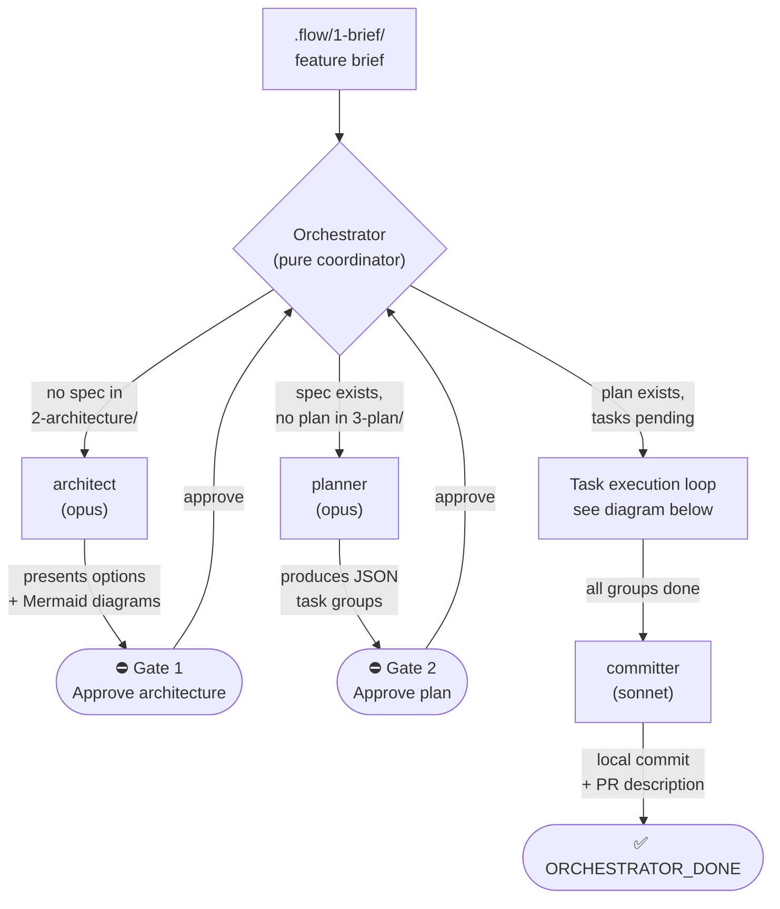
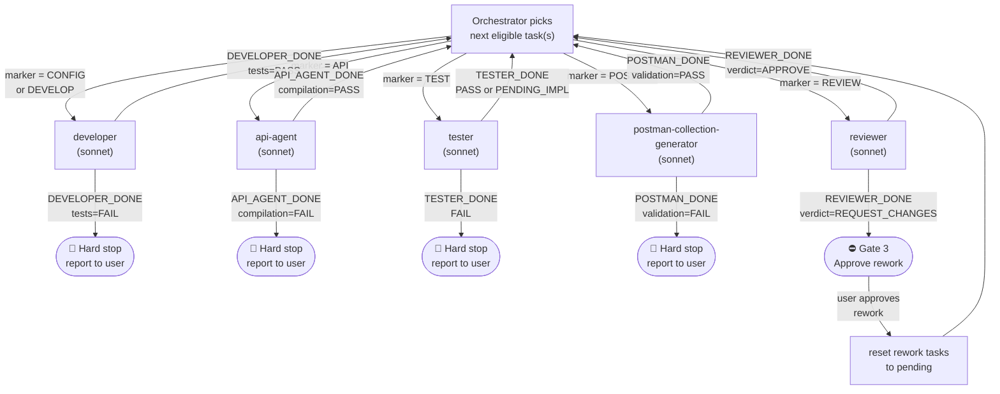

# Claude Code Agentic Pipeline — Framework Guide

A supervised, multi-agent Java + Spring development pipeline (Spring Framework 6, Java 17+;
Maven or Gradle).
A pure-coordinator (`orchestrate`) dispatches specialist agents through four phases,
pausing at human approval gates before irreversible work begins.

---

## Pipeline Overview

### Phase flow



### Task execution loop



---

## Agent Roles

| Agent | Model | Role | Termination line |
|-------|-------|------|-----------------|
| `orchestrate` (skill) | main | Pure coordinator — never produces content | `ORCHESTRATOR_DONE: ...` |
| `architect` | opus | Architecture options, slices, ER/sequence diagrams | `ARCHITECT_DONE: ...` |
| `planner` | opus | Decomposes spec into atomic JSON task groups | `PLANNER_DONE: ...` |
| `api-agent` | sonnet | Lightweight `[API]` worker: spec authoring + codegen | `API_AGENT_DONE: ...` |
| `tester` | sonnet | Red-phase tests only | `TESTER_DONE: ...` |
| `developer` | sonnet | Green-phase production code (`[DEVELOP]`/`[CONFIG]`) | `DEVELOPER_DONE: ...` |
| `reviewer` | sonnet | Multi-dimension review + runs full test suite | `REVIEWER_DONE: ...` |
| `postman-collection-generator` | sonnet | Per-group Postman collection for external entry points | `POSTMAN_DONE: ...` |
| `committer` | sonnet | Stage + commit with conventional-commit message; emit PR description | `COMMITTER_DONE: ...` |
| `jira-content-agent` (optional) | sonnet | Seeds `.flow/1-brief/raw-task.md` from a JIRA ticket (requires the `visamcphub` MCP server) | — |

Knowledge is offloaded to skills (`implement-*`, `api-*`, `test-*`, `spring-patterns`,
`spring-tdd`, `test-driven-development`, `verify`, etc.). Agents stay lightweight and pull
patterns from skills. The `verify` skill is the shared quality gate used by both `developer`
(post-implementation) and `reviewer` (pre-verdict).

**Protocol contract ownership:**

| Agent | Reads `PROTOCOL.md`? | Reason |
|-------|----------------------|--------|
| `orchestrate` (skill) | Yes — full file | Parses all termination lines, drives the state machine, owns dispatch matrix and dependency resolution |
| `architect` | Yes — full file | Produces `ARCHITECT_DONE`, enforces coding policy (UUID IDs, no Records, Flyway) |
| `planner` | Yes — full file | Writes task JSON files; needs the Status State Machine, the full Task-Group Schema, and the Marker Vocabulary sections |
| `api-agent`, `tester`, `developer`, `reviewer`, `committer`, `postman-collection-generator` | **No** | Each agent's `## Pipeline Contract` section contains only what that agent needs: its own termination line format, the status transitions it owns, its marker, and any agent-specific hard stops |

This keeps worker agent context windows tight. `PROTOCOL.md` remains the canonical human reference and the authoritative source for Orchestrator and Planner.

---

## Prerequisites

Install the following before using this framework:

### Claude Code CLI
- Install: https://docs.anthropic.com/en/docs/claude-code
- Authenticate with your Anthropic account.

### Toolchain
- **Java 17+**
- **Maven or Gradle** (the pipeline detects the tool from `pom.xml` vs `build.gradle(.kts)` —
  see `CLAUDE.md` Build Task Vocabulary)
- A **Spring Framework 6** project (Spring Boot optional — test skills adapt to either)

### MCP Servers / Plugins

| MCP server | Purpose                                             | Required |
|-----------|-----------------------------------------------------|---------|
| `web-search` | You could find this MCP repo in current github repo | **Required** |

Install MCP servers via Claude Code settings or your team's MCP configuration file.

## Directory Contract

```
<project-root>/
├── .flow/
│   ├── 1-brief/          # Input: raw feature brief (*.md)
│   ├── 2-architecture/   # Architect output: numbered spec files
│   └── 3-plan/           # Planner output: JSON task group files
├── postman/              # Per-group Postman collections
├── .claude/
│   ├── README.md         # This file
│   ├── PROTOCOL.md       # Single source of truth: grammar, schema, coding policy
│   ├── agents/           # Agent definition files (*.md)
│   │   └── schemas/
│   │       └── task-group.schema.json   # Machine-checkable task JSON schema
│   ├── skills/           # Skill files (*/SKILL.md)
│   └── agent-memory/     # Local agent memory folder
└── src/                  # Java source tree
```

---

## How to Start

1. **Bootstrap** (new projects only):
   ```
   /bootstrap
   ```
   This creates all missing `.flow/*` directories and blank memory templates.

2. **Write your brief:**
   Place a feature description in `.flow/1-brief/raw-task.md`.

3. **Run the orchestrator:**
   ```
   /orchestrate
   ```
   The Orchestrator will check the pipeline state and dispatch the correct phase.

4. **Approval gates** — you will be asked to approve at these points:
   - **Gate 1:** After architecture options are presented — choose an approach.
   - **Gate 2:** After the implementation plan is written — approve or request changes.
   - **Gate 3:** Only when a group review ends in `REQUEST_CHANGES` — approve the rework or
     redirect it. An `APPROVE` verdict is reported and the pipeline continues automatically.

5. **Commit** — after all tasks are done, run `/committer` or the Orchestrator will dispatch the committer agent automatically.

---

## The Protocol

Full contract details are in `.claude/PROTOCOL.md`. That file is read by the Orchestrator, Architect, and Planner only. Worker agents (`api-agent`, `tester`, `developer`, `reviewer`, `committer`, `postman-collection-generator`) do **not** read `PROTOCOL.md` at runtime — their `## Pipeline Contract` section inlines only the fragment they need.

Key points (canonical source: `PROTOCOL.md`):

- **Termination lines** are machine-readable and drive the state machine. Unknown termination lines trigger a hard stop.
- **Status vocabulary:** `pending` → `done`; `needs_rework` → `pending` → `done`. The values `"reviewed"` and `"in_progress"` are forbidden. Workers never modify status — only the Orchestrator sets `done`, and only after a successful termination line.
- **Status fields are flat** on each subtask (`status`, `review_verdict`, `rework_tasks`) — there is no `state` wrapper object.
- **Task JSON schema** is at `.claude/agents/schemas/task-group.schema.json`.
- **Group completion** is detected by inspecting `status` on all subtasks — NOT by renaming files (see PROTOCOL.md Group Completion Detection).
- **`DEVELOPER_DONE` with `tests=FAIL`** is a hard stop — the task is NOT marked done.

---

## How to Extend

### Add a new agent

1. Create `.claude/agents/<name>.md` following the frontmatter + section pattern of existing agents.
   - Add a `## Pipeline Contract` section near the top containing:
     - The agent's termination line (verbatim format)
     - Status transitions the agent owns
     - Its marker (if applicable)
     - Any agent-specific hard stops
   - Do **not** add `Read .claude/PROTOCOL.md` — inline only what the agent needs.
2. Add a row to the dispatch matrix in `.claude/skills/orchestrate/SKILL.md` (Section 5.2).
3. Add the termination-line grammar to `.claude/PROTOCOL.md` (Termination-Line Grammar section) — this keeps the canonical record for Orchestrator and humans.
4. Create `.claude/agent-memory/<name>/MEMORY.md` from the blank template.

### Add a new skill

1. Create `.claude/skills/<name>/SKILL.md` with frontmatter (`name`, `description`).
2. Follow the `"<what it does>. Use when <trigger>."` description format.
3. Reference it by name in the agent's skill table or the planner's `skills` field.

### The lightweight-agent + skill convention

Agents contain only orchestration logic (input processing, dispatch, termination lines).
All reusable patterns (coding style, framework idioms, testing mechanics) live in skills.
Workers pull skills by reading the `SKILL.md` at their stated path.

---

## Portability Checklist

When adopting this framework in a new project or on a new machine:

- [ ] Run `/bootstrap` to scaffold the pipeline directories and blank memory templates.
- [ ] Clear `agent-memory` folder.
- [ ] Confirm `web-search` MCP server is available (required by `CLAUDE.md`).
- [ ] Place a new feature brief in `.flow/1-brief/raw-task.md`.
- [ ] Run `/orchestrate` to start a new agentic flow.
