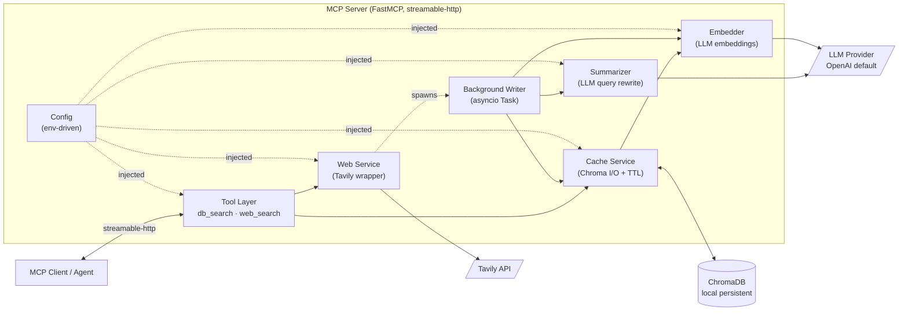
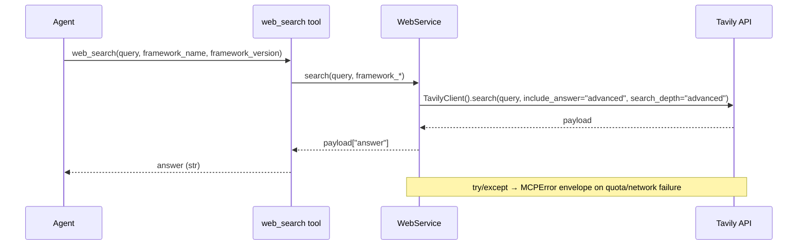
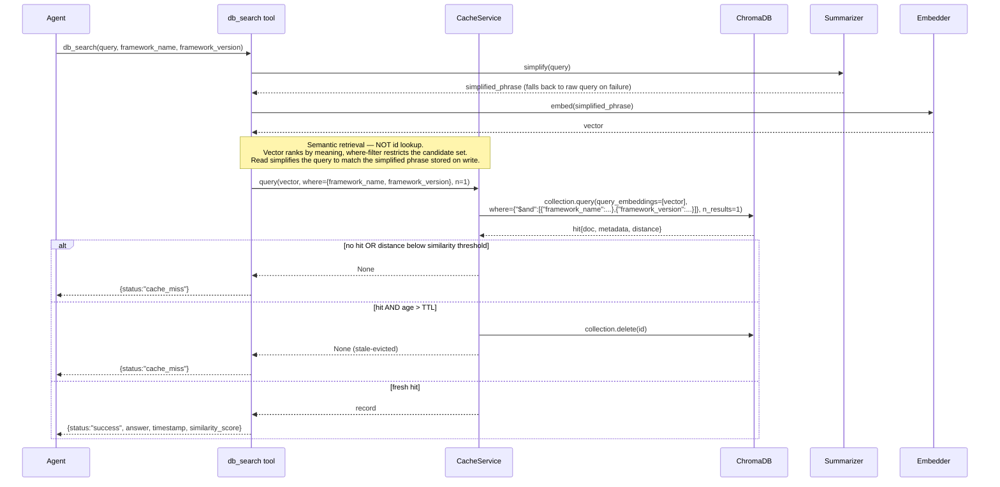
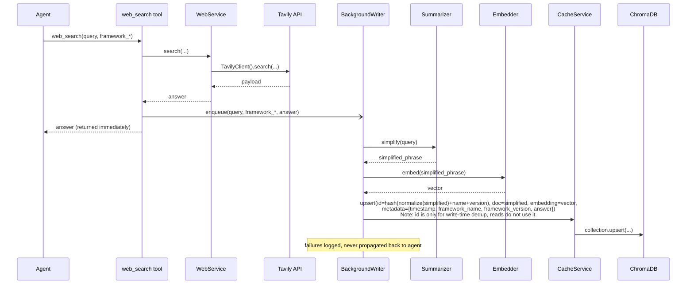
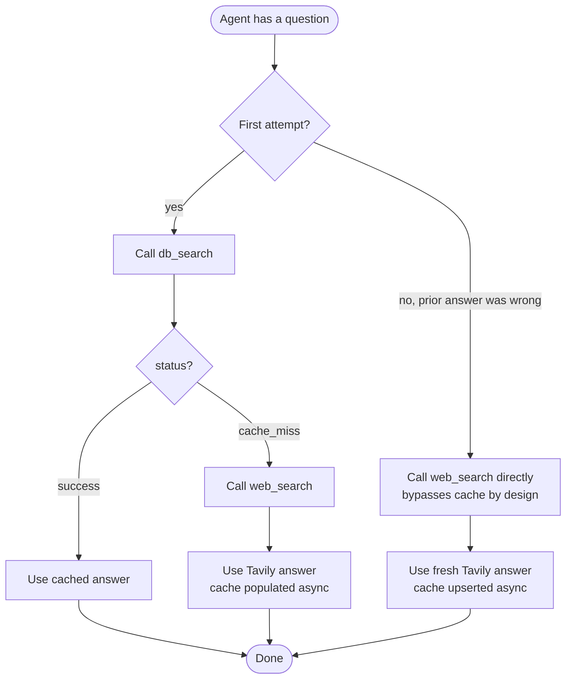

# Architecture: Adaptive Knowledge MCP Server (Tavily + ChromaDB)

**Source spec:** [`.workspace/task/mcp_tavily_chromadb_spec.md`](../.workspace/task/mcp_tavily_chromadb_spec.md)
**Status:** Ready for planning
**Last updated:** 2026-05-29

---

## 1. Architectural Summary

A single-process Python MCP server exposing two tools over `streamable-http`:

- `db_search` — read-only Chroma lookup with TTL + strict version filtering.
- `web_search` — Tavily call; returns answer immediately, persists to Chroma asynchronously.

The two retrieval tools are strictly separated. There is **no fallthrough** between cache and live web inside the server — the calling agent decides which tool to invoke. This is the key invariant that prevents hidden state-machine behavior and makes both tools individually predictable.

### 1.1 Design invariants

| # | Invariant | Why it matters |
|---|---|---|
| I-1 | `db_search` never calls Tavily; `web_search` never reads Chroma. | Removes implicit coupling; agent loop-trap mitigation depends on this. |
| I-2 | `web_search` returns Tavily's answer **before** persistence completes. | Cache write must not be in the critical latency path. |
| I-3 | Chroma `id = hash(normalize(simplified_query) + framework_name + framework_version)` where `normalize` = lowercase + punctuation strip + whitespace collapse. | Deterministic dedup; identical re-asks of the same simplified intent (regardless of casing/punctuation noise) upsert in place, raising the effective cache hit rate. |
| I-4 | The Chroma id is used **only** for `upsert` (dedup on write). It is **never** used as a retrieval key. All reads go through `collection.query(query_embeddings=…, where=…)`. | Querying by exact hash defeats the entire purpose of a vector database — it reduces semantic recall to string equality. |
| I-5 | Retrieval is always `vector_similarity AND strict_metadata_filter`. The filter pins `framework_name` and `framework_version` exactly; the vector search ranks by meaning within that filtered subset. | Prevents v1 answers from leaking into v2 contexts (Spec §6) while preserving semantic recall for paraphrased queries. |
| I-5a | The Chroma collection is created with **cosine** distance (`metadata={"hnsw:space": "cosine"}`), so `similarity_score = 1 - distance` is a true cosine similarity. | Chroma defaults to (squared) L2. On normalized embeddings L2² = `2 − 2·cos`, which makes `1 − distance` ≈ `2·cos − 1` and silently sinks semantically-similar queries below the threshold. |
| I-5b | `db_search` simplifies the query (same `Summarizer` as the write path) **before** embedding, falling back to the raw query if summarization fails. | The cache stores embeddings of the *simplified* phrase; embedding the raw query on read would compare against a different phrasing and depress recall for paraphrased re-asks. |
| I-6 | Stale records (age > TTL) are **deleted at read time**, not lazily flagged. | Read-time GC keeps the collection clean without a background sweeper. |
| I-7 | All external dependencies (Tavily, OpenAI, Chroma path) are injected via a single `Config` object built from env vars. | Enables provider swapping and unit testing without monkey-patching. |

---

## 2. High-Level Component Diagram



Dotted edges represent construction-time wiring or fire-and-forget control flow; solid edges are synchronous call paths.

---

## 3. Module / Package Layout

```text
web-search/
├── pyproject.toml
├── .env.example
├── src/
│   └── mcp_web_search/
│       ├── __init__.py
│       ├── __main__.py           # entrypoint: builds Config, starts FastMCP
│       ├── server.py             # FastMCP instance + tool registration
│       ├── config.py             # Config dataclass; loads env vars
│       ├── tools/
│       │   ├── __init__.py
│       │   ├── db_search.py      # tool impl (thin; delegates to CacheService)
│       │   └── web_search.py     # tool impl (delegates to WebService)
│       ├── services/
│       │   ├── __init__.py
│       │   ├── cache.py          # CacheService: Chroma CRUD + TTL eviction
│       │   ├── web.py            # WebService: Tavily client wrapper
│       │   ├── summarizer.py     # LLM-driven query simplification
│       │   ├── embedder.py       # embedding fn (Chroma EmbeddingFunction proto)
│       │   └── background.py     # async write-back queue/runner
│       ├── llm/
│       │   ├── __init__.py
│       │   ├── base.py           # Protocol: ChatLLM, Embeddings
│       │   └── openai_provider.py
│       └── utils/
│           ├── hashing.py        # deterministic id derivation
│           └── errors.py         # MCPError envelope + formatting
└── tests/
    ├── unit/
    │   ├── test_cache.py
    │   ├── test_web.py
    │   ├── test_summarizer.py
    │   └── test_hashing.py
    └── integration/
        ├── test_tool_db_search.py
        ├── test_tool_web_search.py
        └── test_ttl_eviction.py
```

**Layering rule:** `tools/` may import from `services/`, but never the reverse. `services/` may import from `llm/` and `utils/`, but `llm/` is a leaf. This keeps the MCP boundary swappable (FastMCP could be replaced without touching service logic) and the LLM provider swappable (OpenAI → Anthropic without touching services).

---

## 4. Phase-by-Phase Architecture

The spec defines three incremental phases. Each phase below specifies (a) what modules are introduced, (b) the runtime behavior delivered, and (c) the exit criteria. Phases are designed so the server is *runnable and testable* at the end of each one.

### Phase 1 — MVP: Web Search Only

**Modules introduced:** `config.py`, `server.py`, `__main__.py`, `tools/web_search.py`, `services/web.py`, `llm/` (skeleton, not used yet), `utils/errors.py`.

**Behavior:** Every `web_search` call → Tavily → extract `answer` → return string. No Chroma, no LLM, no background tasks.



**Exit criteria:**
- `python -m mcp_web_search` boots a streamable-http server.
- An MCP client can call `web_search` and receive Tavily's `answer` text.
- Tavily failures return the structured error string from Spec §6 instead of raising.

### Phase 2 — Local Vector Cache (ChromaDB)

**Modules introduced/expanded:** `tools/db_search.py`, `services/cache.py`, `services/summarizer.py`, `services/embedder.py`, `services/background.py`, `llm/openai_provider.py`, `utils/hashing.py`.

**Behavior changes:**
- New tool `db_search`: pure Chroma read with version filter + TTL eviction. Returns `{status, answer, timestamp, similarity_score}`.
- `web_search` is extended to enqueue a background write-back after returning the Tavily answer.





**Why async write-back:** Spec §3.2 demands the Tavily answer be returned immediately. Simplification requires an LLM round-trip (~hundreds of ms to seconds); blocking on it would double `web_search` latency for no agent-visible benefit. The background task uses `asyncio.create_task` (FastMCP runs on asyncio), with the task reference held in a module-level set to prevent GC — standard asyncio fire-and-forget pattern.

**ChromaDB storage shape:**

| Column | Source | Example |
|---|---|---|
| `id` | `sha256(normalize(simplified_query) \| framework_name \| framework_version)[:32]` — **used only for upsert dedup; never queried by** | `"a3f1...c9"` |
| `embedding` | embedder(simplified_query) | `[0.012, -0.034, ...]` (1536-d for OpenAI default) |
| `document` | simplified_query | `"instantiate agent in langchain"` |
| `metadata.timestamp` | `int(time.time())` at write | `1748520000` |
| `metadata.framework_name` | tool argument | `"langchain"` |
| `metadata.framework_version` | tool argument | `"0.3.1"` |
| `metadata.answer` | Tavily `answer` payload | `"To instantiate an agent..."` |

**Note on `answer` placement:** ChromaDB returns documents and metadata together; storing the full `answer` text in `metadata.answer` (rather than as the `document`) keeps the embedded text small and topical (the simplified phrase) while preserving the rich payload for retrieval. This matches Spec §4.1: "Document Content" = simplified phrase; "Entity Mapping" returned on hit = the Tavily answer.

**Exit criteria:**
- `db_search` returns `success` for prior `web_search` queries on the same `framework_name + framework_version`.
- Records older than `CACHE_TTL_DAYS` (default 30) are evicted on read and the result is `cache_miss`.
- Mismatched `framework_version` always yields `cache_miss` regardless of semantic similarity.


## 5. Cross-Cutting Concerns

### 5.1 Configuration (`config.py`)

Single `Config` dataclass, loaded once at startup from environment variables:

| Env var | Default                           | Purpose |
|---|-----------------------------------|---|
| `TAVILY_API_KEY` | *(required)*                      | Tavily auth |
| `LLM_PROVIDER` | `openai`                          | Provider switch (currently only `openai` implemented; protocol-based). **Validated at startup** — an unsupported value raises `ValueError`. |
| `OPENAI_API_KEY` | *(required when provider=openai)* | OpenAI auth |
| `EMBEDDING_MODEL` | `text-embedding-3-small`          | Used by `Embedder`. **Validated** against the provider's embedding-model allowlist. |
| `SUMMARIZATION_MODEL` | `gpt-5-mini`                      | Used by `Summarizer`. **Validated** against the provider's chat-model allowlist. |
| `CHROMA_PATH` | `./.chroma`                       | Persistent local Chroma dir |
| `CHROMA_COLLECTION` | `web_search_cache`                | Collection name |
| `CACHE_TTL_DAYS` | `30`                              | TTL boundary (Spec §4.3) |
| `SIMILARITY_THRESHOLD` | `0.75`                            | Min cosine similarity for a cache hit. Lowered from the spec's 0.85 because the exact `framework_name`+`framework_version` filter already narrows the candidate set, so a moderate threshold matches paraphrased re-asks without false positives (see I-5a). |
| `MCP_HTTP_HOST` | `127.0.0.1`                       | streamable-http bind |
| `MCP_HTTP_PORT` | `8000`                            | streamable-http port |
| `LOG_LEVEL` | `INFO`                            | Log verbosity: `DEBUG`/`INFO`/`WARNING`/`ERROR`/`CRITICAL`. Validated at startup. See §5.6. |

`Config` is constructed in `__main__.py` and passed into each service's `__init__`. Services do **not** read env vars directly. A committed `.env.example` documents every variable; copy it to `.env` (gitignored) and fill in secrets.

**Startup validation (fail-fast):** `Config.from_env()` rejects an unsupported `LLM_PROVIDER` and any `SUMMARIZATION_MODEL` / `EMBEDDING_MODEL` not in the provider's allowlist (`SUPPORTED_LLM_PROVIDERS`, `SUPPORTED_OPENAI_CHAT_MODELS`, `SUPPORTED_OPENAI_EMBEDDING_MODELS` in `config.py`). This surfaces typos/misconfiguration at boot rather than on the first LLM call.

### 5.2 LLM Provider Abstraction (`llm/base.py`)

```python
class ChatLLM(Protocol):
    async def complete(self, system: str, user: str) -> str: ...

class Embeddings(Protocol):
    async def embed(self, texts: list[str]) -> list[list[float]]: ...
```

`openai_provider.py` provides concrete impls. Adding another provider = one new file + one branch in the factory in `__main__.py`. The `Embedder` service implements Chroma's `EmbeddingFunction` interface internally and delegates to whichever `Embeddings` impl was injected — this isolates Chroma's sync API contract from the async LLM clients.

### 5.3 Error Handling Strategy

Three failure classes, three responses:

| Failure | Where caught | Response to agent |
|---|---|---|
| Tavily quota / network | `services/web.py` try/except around `TavilyClient.search` | Spec §6 structured error string returned as the tool's normal output (so the agent can adapt without an MCP-protocol-level error). |
| Chroma read error in `db_search` | `tools/db_search.py` | Treated as `cache_miss` + logged warning. A broken cache must never block the agent. |
| Background write failure | `services/background.py` | Logged at WARN; never raised. The agent already has the Tavily answer. |
| LLM (summarize/embed) failure in background | `services/background.py` | Logged at WARN; record is skipped (not written). Next `web_search` for the same query will retry. |
| LLM embed failure inside `db_search` | `tools/db_search.py` | Returned as `cache_miss`; logged. |

### 5.4 Concurrency Model

FastMCP runs on asyncio. All tool handlers are `async def`. The single-process server may serve concurrent tool calls; therefore:

- `CacheService` calls into Chroma's sync client via `asyncio.to_thread` to avoid blocking the event loop on disk I/O.
- Background tasks created by `web_search` are tracked in a module-level `set[asyncio.Task]` with a `task.add_done_callback(set.discard)` to keep references alive and surface exceptions to the logger.

### 5.5 Hashing for Deterministic IDs (`utils/hashing.py`)

The id is used **exclusively** for `collection.upsert(...)` — i.e., to dedup writes when the same simplified intent for the same framework+version is re-cached. **It is never used at read time.** All reads use vector similarity with a metadata filter (see I-4 / I-5).

**Two-step derivation:**

```text
normalized = normalize(simplified_query)
id         = sha256(f"{normalized}\x1f{framework_name}\x1f{framework_version}").hexdigest()[:32]
```

**`normalize(text)`** applies, in order:

1. `text.lower()` — case-insensitive collisions ("Instantiate Agent" == "instantiate agent").
2. Strip punctuation — `re.sub(r"[^\w\s]", " ", text)` (keep letters/digits/underscore + whitespace).
3. Collapse whitespace — `re.sub(r"\s+", " ", text).strip()`.

This raises the effective hit rate: trivial cosmetic differences in the simplified phrase ("how to instantiate agent." vs. "How to instantiate agent") map to the same id and upsert in place instead of polluting the collection with near-duplicates.

The `\x1f` (ASCII unit separator) delimiter prevents collisions from field values that contain `|` or whitespace. 32 hex chars = 128 bits of entropy, well below collision risk for the expected dataset size.

### 5.6 Logging & Observability

Logging is configured once in `__main__.py` from `LOG_LEVEL` (default `INFO`). `logging.basicConfig` sets the root level, and the `mcp_web_search` / `mcp` loggers are explicitly pinned so they survive uvicorn's logging setup (uvicorn's `LOGGING_CONFIG` is patched to register the `mcp_web_search` logger with `propagate=False`). All modules use `logging.getLogger(__name__)`; submodule loggers (e.g. `mcp_web_search.tools.web_search`, `mcp_web_search.services.cache`) inherit the level from the `mcp_web_search` parent.

**What is emitted at `INFO`:**

| Source | Event | Logged fields |
|---|---|---|
| `server.py` middleware | Every MCP request and response | method, message type, JSON payload |
| `tools/web_search.py` | `web_search` request | query, framework_name, framework_version |
| `tools/web_search.py` | `web_search` response | success flag, answer |
| `tools/db_search.py` | `db_search` request | query, framework_name, framework_version |
| `tools/db_search.py` | `db_search` response | status (`success`/`cache_miss`), similarity_score, timestamp, answer |
| `services/cache.py` | **Stored to DB** (`upsert`) | id, document (simplified phrase), framework_name, framework_version, timestamp, answer |
| `services/cache.py` | **Retrieved from DB** (`query`) | id, similarity_score, timestamp, answer; plus threshold-rejection and TTL stale-eviction outcomes |

This makes the full Phase 2 cache lifecycle (what went in, what came back out, and why a record was kept/rejected/evicted) visible at `INFO` without enabling `DEBUG`. Background write-back failures and degraded-cache fallbacks remain at `WARNING` per §5.3.

---

## 6. Request Lifecycle Across Phases

The end-to-end picture once all three phases are in place — illustrating the agent's expected call pattern:



This pattern makes the **agent loop-trap mitigation explicit and tool-level**: switching from `db_search` to `web_search` is the deterministic escape hatch (Spec §6, revised).

---

## 7. Testing Strategy

| Layer | Approach |
|---|---|
| `utils/hashing` | Pure unit tests — determinism, delimiter safety, and `normalize` correctness (case-folding, punctuation stripping, whitespace collapse → same id). |
| `services/cache` | Unit tests against a temp ChromaDB dir; cover hit, miss, TTL eviction, version mismatch, similarity threshold. |
| `services/web` | Unit tests with mocked `TavilyClient`; cover happy path, network error, missing `answer` field. |
| `services/summarizer`, `services/embedder` | Unit tests with mocked `ChatLLM` / `Embeddings`. |
| `services/background` | Test that `web_search` returns before write completes (timing assertion + fake slow LLM); test that LLM failure does not crash the server. |
| `tools/*` | Integration tests that spin up FastMCP in-process and invoke tools via the MCP client SDK; verify JSON shapes match Spec §3. |
| End-to-end | One smoke test with real Tavily key (gated by env var) — ensures the live integration stays working. |

---

## 8. Open Items / Deferred Decisions

These are intentionally **out of scope** for the current spec but worth flagging for future iterations:

1. **Multi-process safety:** Chroma's local persistent client is not multi-writer safe. If the server is ever run with multiple worker processes, a different backend or process-coordination layer is needed.
2. **Embedding model migration:** Changing `EMBEDDING_MODEL` invalidates all existing vectors (different dimensionality / semantic space). A migration script or a model-version field in the collection name would be needed; current design assumes the model is fixed for the lifetime of a Chroma directory.
